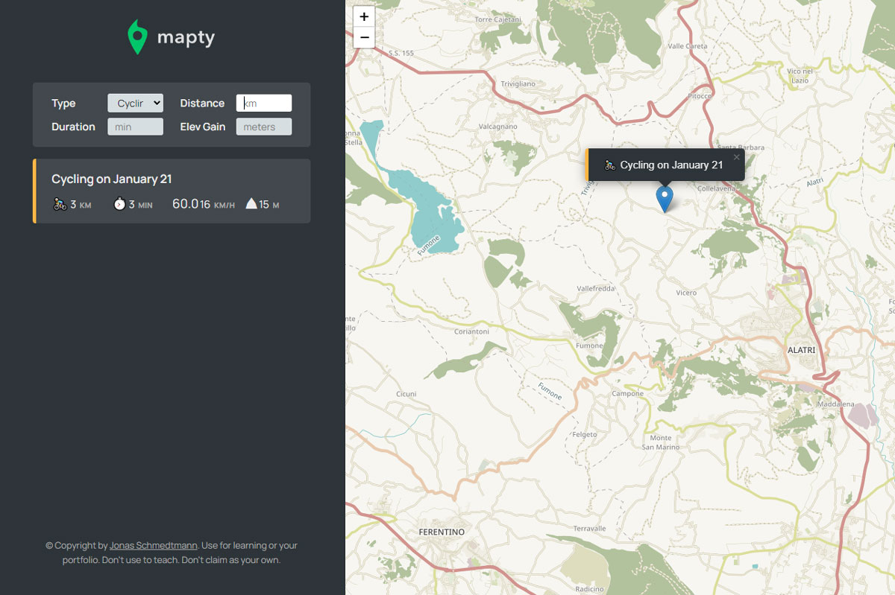

# Mapty App

This is a project I did for [Jonas Schmedtmann's Udemy Javascript Bootcamp](https://www.udemy.com/course/the-complete-javascript-course/).

## Table of contents

- [Overview](#overview)
  - [The Project](#the-challenge)
  - [Screenshot](#screenshot)
  - [Links](#links)
- [My process](#my-process)
  - [Built with](#built-with)
  - [What I learned](#what-i-learned)
- [Acknowledgments](#acknowledgments)

## Overview

### The Project

This project was created by Jonas Schmedtmann to aid his students in mastering OOP in JavaScript.

The purpose of this app is to enable users to track their workout progress on a map, choosing between running and cycling. To use the app, simply click on the map to record the completed workout; this information is then saved in local storage, allowing users to track their progress even after closing the app.

### Screenshot

### Links

- Live Site URL: [Live Link](https://herecomesfed.github.io/mapty-app/)

## My process

### Built with

- HTML5
- CSS3
- Vanilla Javascript ES6+
- OOP
- Class Keyword
- Private Classes
- Leaflet Library
- Fetch API

### What I learned

This was an amazing project that helped me deep dive into the OOP World in Javascript.

## Acknowledgments

Big Thank You to Jonas Schmedtmann for this amazing course on Udemy.
